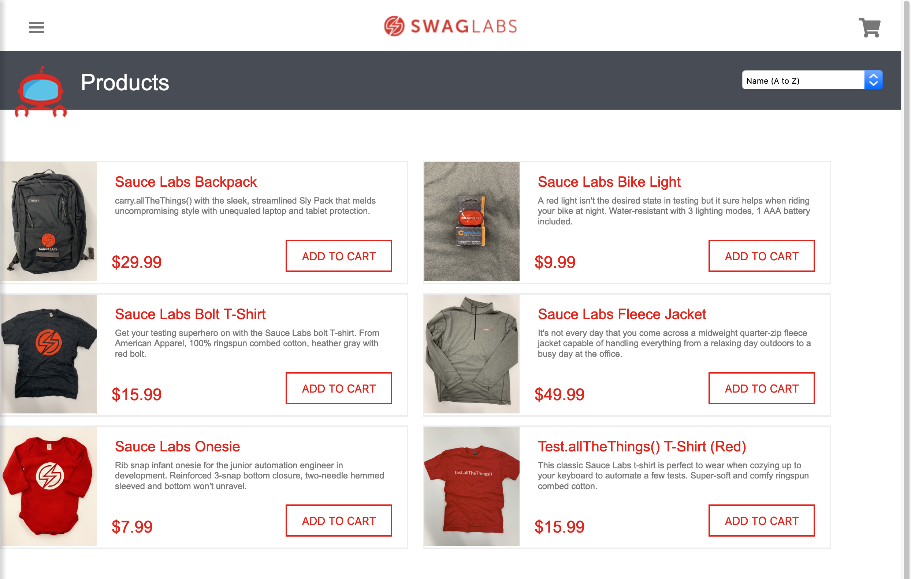
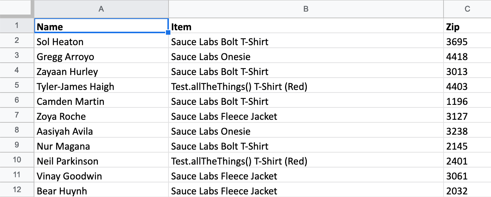

_Swag Labs web store_


_Orders Excel file_

This robot will process [web store](https://www.saucedemo.com/) orders based on the given input Excel file.

The robot uses provided credentials for logging into the store. The credentials are considered sensitive information. The credentials are stored in _environment variables_ in order to not expose them in the code repository.

> Never commit sensitive information in your project. Provide the credentials for your robot from environment variables or with some other mechanism where the credentials are not exposed.

To provide the web store orders for the robot from the Excel file, you are going to implement an order processing library using [Python](https://www.python.org/) and [pandas](https://pandas.pydata.org/) library.

To make setting up and running your robot easier, you are also going to provide some _scripts_ to ease the setup and execution. These scripts handle the installation of required libraries and drivers and provide an easy way to run the robot.

When run, the robot will:

- open a real web browser and load the web store login page
- log into the web store using credentials provided using environment variables
- collect the orders from the provided Excel file using a custom Python library
- loop through the orders and complete the checkout for each order
- write log and report files
- close the browser on process completion

## Prerequisites

> To complete this tutorial, you need to have [Chrome](https://www.google.com/chrome/) installed. You also need a working [Python](https://www.python.org/) installation. On macOS / Linux, you can open the terminal and try running `python3 --version` to check if you have the required Python installed. On Windows, you can open the command prompt and try running `py --version` to check if you have the required Python installed.

You will start by creating some setup files and scripts to aid with setting up and executing your robot. The scripts will also help other people who want to use your robot to get everything up and running easily.

## Project directory

Create a new `swag-order-robot` directory. This directory will contain the robot script and other required resources.

## Requirements file

You are going to use several libraries when implementing your robot. To make installing them easier, you are going to provide the list of required libraries in a text file. [pip](https://pypi.org/project/pip/) can read this file and handle the installation for you.

Inside the `swag-order-robot` directory, create a file by name `requirements.txt`. Paste the following libraries in the file:

```
pandas
robotframework
robotframework-seleniumlibrary
webdrivermanager
xlrd
```

## Installation script: macOS / Linux

Inside the `swag-order-robot` directory, create a new `scripts` directory. This directory will contain the scripts for setting up and running your robot.

In the `scripts` directory, create a file by name `prepare.sh`. Paste the following _shell script_ in the `prepare.sh` file:

```bash
#!/bin/bash

if [[ $# -eq 0 ]] ; then
    export browser=chrome
else
    export browser=$1
fi

python3 -m venv venv
. venv/bin/activate

pip install --upgrade wheel pip setuptools
pip install -r requirements.txt

webdrivermanager $browser
```

Save the shell script.

Make sure the shell script has _execution permissions_ by running the following command in the terminal:

```bash
chmod u+x prepare.sh
```

Your directory structure should look like this:

```bash
swag-order-robot
├── requirements.txt
└── scripts
    └── prepare.sh
```

Navigate to the `swag-order-robot` directory.

Execute the installation script to setup required libraries and drivers by running the following command:

```bash
./scripts/prepare.sh
```

The example output should look similar to this (cropped):

```bash
$ ./scripts/prepare.sh
Collecting wheel
  Downloading https://files.pythonhosted.org/packages/8c/23/848298cccf8e40f5bbb59009b32848a4c38f4e7f3364297ab3c3e2e2cd14/wheel-0.34.2-py2.py3-none-any.whl
Collecting pip
  Using cached https://files.pythonhosted.org/packages/54/0c/d01aa759fdc501a58f431eb594a17495f15b88da142ce14b5845662c13f3/pip-20.0.2-py2.py3-none-any.whl
Collecting setuptools
  Using cached https://files.pythonhosted.org/packages/a7/c5/6c1acea1b4ea88b86b03280f3fde1efa04fefecd4e7d2af13e602661cde4/setuptools-45.1.0-py3-none-any.whl
Installing collected packages: wheel, pip, setuptools
  Found existing installation: pip 19.0.3
    Uninstalling pip-19.0.3:
      Successfully uninstalled pip-19.0.3
  Found existing installation: setuptools 40.8.0
    Uninstalling setuptools-40.8.0:
      Successfully uninstalled setuptools-40.8.0
Successfully installed pip-20.0.2 setuptools-45.1.0 wheel-0.34.2
Collecting pandas
  Using cached pandas-1.0.0-cp37-cp37m-macosx_10_9_x86_64.whl (9.8 MB)
Collecting robotframework
  Using cached robotframework-3.1.2-py2.py3-none-any.whl (602 kB)
Collecting robotframework-seleniumlibrary
  Downloading robotframework_seleniumlibrary-4.2.0-py2.py3-none-any.whl (91 kB)
     |████████████████████████████████| 91 kB 2.2 MB/s
...
...
Downloading WebDriver for browser: "chrome"
6747kb [00:01, 6002.92kb/s]
Driver binary downloaded to: "/your-projects-directory/swag-order-robot/venv/WebDriverManager/chrome/79.0.3945.36/chromedriver_mac64/chromedriver"
Symlink created: /your-projects-directory/swag-order-robot/venv/bin/chromedriver
```

## Run script: macOS / Linux

To make running your robot easier, you are going to create a shell script for that purpose.

Inside the `scripts` directory, create a file by name `run.sh` and paste in the following shell script:

```bash
#!/bin/bash

. venv/bin/activate

python -m robot -d output -P libraries -P resources -P variables --logtitle "Task log" tasks/

```

Make sure the shell script has execution permissions by running the following command in the terminal:

```bash
chmod u+x run.sh
```

## Installation script: Windows

Inside the `swag-order-robot` directory, create a new `scripts` directory. This directory will contain the scripts for setting up and running your robot.

In the `scripts` directory, create a file by name `prepare.bat`. Paste the following _Windows batch script_ in the `prepare.bat` file:

```batch
py -m venv venv
call venv\Scripts\activate

python -m pip install --upgrade pip
pip install -r requirements.txt
webdrivermanager chrome

call venv\Scripts\deactivate

```

Save the batch script.

Your directory structure should look like this:

```bash
swag-order-robot
├── requirements.txt
└── scripts
    └── prepare.bat
```

Navigate to the `swag-order-robot` directory.

Execute the installation script to setup required libraries and drivers by running the following command:

```
scripts\prepare.bat
```

## Run script: Windows

To make running your robot easier, you are going to create a Windows batch script for that purpose.

Inside the `scripts` directory, create a file by name `run.bat` and paste in the following Windows batch script:

```batch
call venv\Scripts\activate

python -m robot -d output -P libraries -P resources -P variables --logtitle "Task log" tasks/

call venv\Scripts\deactivate

```

## Robot script

Inside the `swag-order-robot` directory, create a directory by name `tasks`.

Inside the `tasks` directory, create a file by name `swag-order-robot.robot`.

Paste the following Robot Framework code in the `swag-order-robot.robot` file:

```robot
*** Settings ***
Documentation   Swag order robot. Places orders at https://www.saucedemo.com/
...             by processing a spreadsheet of orders and ordering the
...             specified products using browser automation. Uses environment
...             variables for credentials.
Resource        keywords.resource

*** Tasks ***
Place orders
    Process orders
```

## Keywords resource file

Inside the `swag-order-robot` directory, create a directory by name `resources`.

Inside the `resources` directory, create a file by name `keywords.resource`.

Paste the following Robot Framework code in the `keywords.resource` file:

```robot
*** Settings ***
Library     OperatingSystem
Library     Orders
Library     SeleniumLibrary
Variables   variables.py

*** Keywords ***
Process orders
    Validate prerequisites
    Open Swag Labs
    Wait Until Keyword Succeeds     3x  1s  Login   ${SWAG_LABS_USER_NAME}  ${SWAG_LABS_PASSWORD}
    @{orders}=                      Collect orders

    FOR     ${order}    IN  @{orders}
        Run Keyword And Continue On Failure     Process order   ${order}
    END

    [Teardown]                      Close Browser

Validate prerequisites
    File Should Exist       ${EXCEL_FILE_PATH}
    Variable Should Exist   ${SWAG_LABS_USER_NAME}
    Variable Should Exist   ${SWAG_LABS_PASSWORD}

Open Swag Labs
    Open Browser    ${SWAG_LABS_URL}    Chrome

Login
    [Arguments]         ${user_name}    ${password}
    Input Text          user-name       ${user_name}
    Input Password      password        ${password}
    Submit Form
    Assert logged in

Assert logged in
    Location Should Be  ${SWAG_LABS_URL}/inventory.html

Collect orders
    @{orders}=  Get orders          ${EXCEL_FILE_PATH}
    [Return]    @{orders}

Process order
    [Arguments]                     ${order}
    Reset application state
    Open products page
    Assert cart is empty
    Wait Until Keyword Succeeds     3x  1s  Add product to cart     ${order}
    Wait Until Keyword Succeeds     3x  1s  Open cart
    Assert one product in cart      ${order}
    Checkout                        ${order}
    Open products page

Reset application state
    Click Button                    css:.bm-burger-button button
    Wait Until Element Is Visible   id:reset_sidebar_link
    Click Link                      reset_sidebar_link

Open products page
    Go To   ${SWAG_LABS_URL}/inventory.html

Assert cart is empty
    Element Text Should Be              css:.shopping_cart_link     ${EMPTY}
    Page Should Not Contain Element     css:.shopping_cart_badge

Add product to cart
    [Arguments]             ${order}
    ${product_name}=        Set Variable    ${order["item"]}
    ${locator}=             Set Variable    xpath://div[@class="inventory_item" and descendant::div[contains(text(), "${product_name}")]]
    ${product}=             Get WebElement  ${locator}
    ${add_to_cart_button}=  Set Variable    ${product.find_element_by_class_name("btn_primary")}
    Click Button            ${add_to_cart_button}
    Assert items in cart    1

Assert items in cart
    [Arguments]             ${quantity}
    Element Text Should Be  css:.shopping_cart_badge    ${quantity}

Open cart
    Click Link          css:.shopping_cart_link
    Assert cart page

Assert cart page
    Location Should Be  ${SWAG_LABS_URL}/cart.html

Assert one product in cart
    [Arguments]             ${order}
    Element Text Should Be  css:.cart_quantity          1
    Element Text Should Be  css:.inventory_item_name    ${order["item"]}

Checkout
    [Arguments]                         ${order}
    Click Link                          css:.checkout_button
    Assert checkout information page
    Input Text                          first-name      ${order["first_name"]}
    Input Text                          last-name       ${order["last_name"]}
    Input Text                          postal-code     ${order["zip"]}
    Submit Form
    Assert checkout confirmation page
    Click Link                          css:.btn_action
    Assert checkout complete page

Assert checkout information page
    Location Should Be  ${SWAG_LABS_URL}/checkout-step-one.html

Assert checkout confirmation page
    Location Should Be  ${SWAG_LABS_URL}/checkout-step-two.html

Assert checkout complete page
    Location Should Be  ${SWAG_LABS_URL}/checkout-complete.html

```

## Variables file

Inside the `swag-order-robot` directory, create a directory by name `variables`.

Inside the `variables` directory, create a file by name `variables.py`.

Paste the following Python code in the `variables.py` file:

```py
import os

EXCEL_FILE_PATH = "./data/Data.xlsx"
SWAG_LABS_URL = "https://www.saucedemo.com"
SWAG_LABS_PASSWORD = os.getenv("SWAG_LABS_PASSWORD")
SWAG_LABS_USER_NAME = os.getenv("SWAG_LABS_USER_NAME")
```

## Order processing library

In order to read in an Excel file and to transform the Excel data to orders for the robot, you are going to implement a custom order collecting library using Python and `pandas` library.

Inside the `swag-order-robot` directory, create a directory by name `libraries`.

Inside the `libraries` directory, create a file by name `Orders.py` and paste in the following code:

```py
import pandas


class Orders:
    def get_orders(self, excel):
        data_frame = pandas.read_excel(excel)
        orders = []
        for row in data_frame.values:
            order = {
                "item": row[1],
                "zip": row[2],
                "first_name": row[0].split()[0],
                "last_name": row[0].split()[1]
            }
            orders.append(order)
        return orders
```

## Excel file

The order information is stored in an Excel file (`Data.xlsx`). The file is formatted as follows:

| Name               | Item                              | Zip  |
| ------------------ | --------------------------------- | ---- |
| Sol Heaton         | Sauce Labs Bolt T-Shirt           | 3695 |
| Gregg Arroyo       | Sauce Labs Onesie                 | 4418 |
| Zayaan Hurley      | Sauce Labs Bolt T-Shirt           | 3013 |
| Tyler-James Haigh  | Test.allTheThings() T-Shirt (Red) | 4403 |
| Camden Martin      | Sauce Labs Bolt T-Shirt           | 1196 |
| Zoya Roche         | Sauce Labs Fleece Jacket          | 3127 |
| Aasiyah Avila      | Sauce Labs Onesie                 | 3238 |
| Nur Magana         | Sauce Labs Bolt T-Shirt           | 2145 |
| Neil Parkinson     | Test.allTheThings() T-Shirt (Red) | 2401 |
| Vinay Goodwin      | Sauce Labs Fleece Jacket          | 3061 |
| Bear Huynh         | Sauce Labs Fleece Jacket          | 2032 |
| Nathanael Burch    | Test.allTheThings() T-Shirt (Red) | 1827 |
| Lewie Ridley       | Sauce Labs Onesie                 | 4677 |
| Sian Escobar       | Sauce Labs Backpack               | 3475 |
| Kayson Morton      | Sauce Labs Bolt T-Shirt           | 2870 |
| Hester Holding     | Sauce Labs Fleece Jacket          | 2168 |
| Carrie-Ann Cobb    | Sauce Labs Backpack               | 3471 |
| Alanah Barry       | Sauce Labs Onesie                 | 1373 |
| Lindsay Villanueva | Test.allTheThings() T-Shirt (Red) | 2062 |
| Skyla Herbert      | Test.allTheThings() T-Shirt (Red) | 3008 |
| Aaliyah Aguirre    | Sauce Labs Bolt T-Shirt           | 2874 |
| Reema Oconnell     | Sauce Labs Bolt T-Shirt           | 3102 |
| Camilla Griffin    | Sauce Labs Bike Light             | 1644 |
| Misha Warren       | Sauce Labs Backpack               | 3270 |
| Amalia Hampton     | Sauce Labs Bolt T-Shirt           | 3261 |
| Ahmet Ford         | Sauce Labs Fleece Jacket          | 3512 |
| Iosif Woods        | Test.allTheThings() T-Shirt (Red) | 2648 |
| Hiba Swan          | Sauce Labs Bolt T-Shirt           | 2162 |
| Elif Lees          | Sauce Labs Bolt T-Shirt           | 3703 |
| Lenny Rasmussen    | Sauce Labs Bolt T-Shirt           | 4518 |
| Jada Hicks         | Sauce Labs Backpack               | 2647 |
| Johan Ingram       | Sauce Labs Onesie                 | 4961 |
| Ayush Sampson      | Sauce Labs Onesie                 | 1893 |
| Jaxson Whitney     | Sauce Labs Onesie                 | 3812 |
| Princess Townsend  | Sauce Labs Onesie                 | 3892 |
| Brandan Dillon     | Sauce Labs Bolt T-Shirt           | 3218 |

Inside the `swag-order-robot` directory, create a directory by name `data`.

[Download the Excel file](https://github.com/janipalsamaki/swag-order-robot/raw/master/data/Data.xlsx) and save it in the `data` directory.

## Credential environment variables

The robot reads the credentials from the environment variables. On macOS Catalina, when using `zsh`, you can define the environment variables in `~/.zshrc` file. The `~` means your _home folder_.

> Create the `.zshrc` in your home folder if it does not exist. You can navigate to your home folder by running `cd` command in the terminal.

In the `.zshrc` file (or similar, if using `bash`), add the environment variables:

```bash
# Swag Labs credentials
export SWAG_LABS_PASSWORD=secret_sauce
export SWAG_LABS_USER_NAME=standard_user
```

> You may need to open up a new terminal to load the environment variables. Another way is to run `source ~/.zshrc` after editing the `.zshrc` file. You can run `env` command to verify that the environment variables have been set successfully.

If you are using Windows, you can follow these [instructions on setting environment variables in Windows 10](https://www.techjunkie.com/environment-variables-windows-10/).

## Running the robot

Your directory structure should look like this:

```bash
swag-order-robot
├── data
│   └── Data.xlsx
├── libraries
│   └── Orders.py
├── requirements.txt
├── resources
│   └── keywords.resource
├── scripts
│   ├── prepare.sh (or prepare.bat)
│   └── run.sh (or run.bat)
├── tasks
│   └── swag-order-robot.robot
└── variables
    └── variables.py

```

In the terminal, navigate to the `swag-order-robot` directory and execute (run) the robot:

macOS / Linux:

```bash
./scripts/run.sh
```

Windows:

```
scripts\run.bat
```

The example output might look something like the following:

```bash
==============================================================================
Swag-Order-Robot :: Swag order robot. Places orders at https://www.saucedem...
==============================================================================
Place orders                                                          | PASS |
------------------------------------------------------------------------------
Swag-Order-Robot :: Swag order robot. Places orders at https://www... | PASS |
1 critical task, 1 passed, 0 failed
1 task total, 1 passed, 0 failed
==============================================================================
Output:  /your-projects-directory/swag-order-robot/output/output.xml
Log:     /your-projects-directory/swag-order-robot/output/log.html
Report:  /your-projects-directory/swag-order-robot/output/report.html
```

> The robot will complain if the credential environment variables or the Excel file do not exist.

## Summary

You executed an order processing robot, congratulations!

During the process, you learned some concepts and features of the Robot Framework:

- [x] Using environment variables for sensitive data (`os.getenv("SWAG_LABS_PASSWORD")`)
- [x] Validating task prerequisites (`File Should Exist`, `Variable Should Exist`)
- [x] Asserting task state (`Assert logged in`, `Assert item in cart`...)
- [x] Resetting task state for the next item (`Reset application state`)
- [x] Retrying keywords `n` times with a given delay (`Wait Until Keyword Succeeds`)
- [x] Implementing a custom library (`lib/Orders.py`)
- [x] Using a third-party library in your own library (`import pandas`)
- [x] Reading Excel files and transforming to business entities (orders)
- [x] Defining library dependencies (`requirements.txt`)
- [x] Using an installation script to ease installation (`scripts/prepare.sh`, `scripts/prepare.bat`)
- [x] Using a run script to ease execution (`scripts/run.sh`, `scripts/run.bat`)
- [x] Organizing your project files in subdirectories
